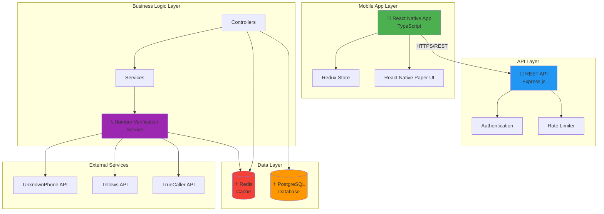
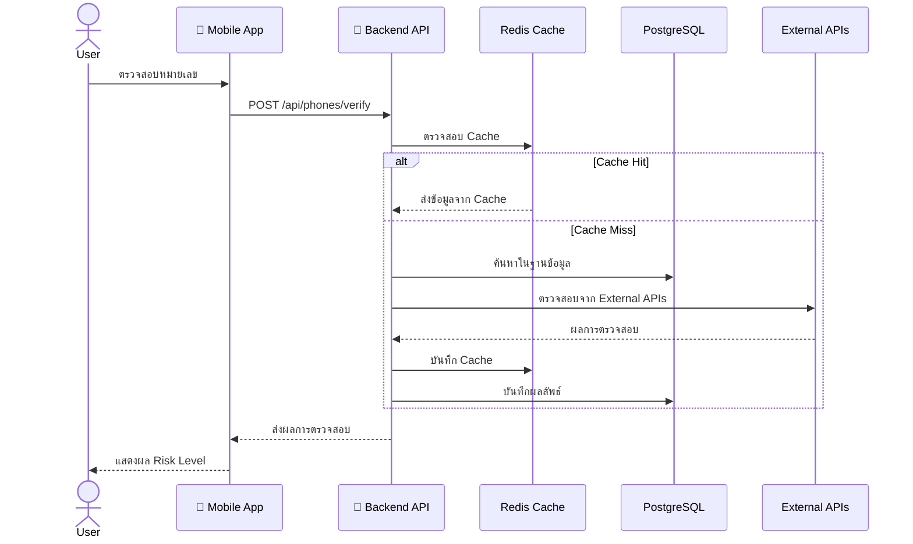
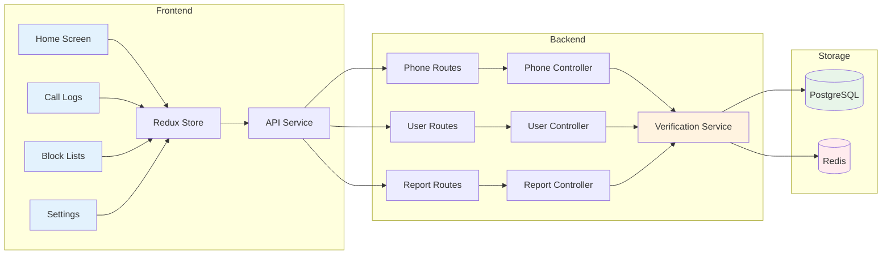

# KnowCall

> แอปพลิเคชันป้องกันการโทรหลอกลวงและสแปมสำหรับผู้ใช้ไทย

[](https://opensource.org/licenses/MIT)
[]()

## 📚 เอกสาร (Documentation)

- **[Wiki](https://github.com/Nontawatt/knowcall/wiki)** - คู่มือการใช้งานแบบละเอียด
- **[Getting Started](docs/wiki/Getting-Started.md)** - เริ่มต้นใช้งาน
- **[Phone Verification](docs/wiki/Phone-Verification.md)** - วิธีตรวจสอบหมายเลข
- **[FAQ](docs/wiki/FAQ.md)** - คำถามที่พบบ่อย
- **[Safety Tips](docs/wiki/Safety-Tips.md)** - เคล็ดลับความปลอดภัย
- **[API Documentation](docs/API.md)** - เอกสาร API
- **[Architecture](docs/ARCHITECTURE.md)** - สถาปัตยกรรมระบบ
- **[Setup Guide](docs/SETUP.md)** - คู่มือการติดตั้ง

## แนวคิด (Concept)

KnowCall เป็นแอปพลิเคชันป้องกันและแจ้งเตือนสายโทรศัพท์ พอร์ทโทรศัพท์ หรือข้อความที่เป็นมิจฉาชีพและสแปมสำหรับผู้ใช้ในประเทศไทย โดยเน้นความปลอดภัยและความเป็นส่วนตัวของผู้ใช้ แอปนี้จะมีฐานข้อมูลเลขโทรศัพท์และโดเมนที่น่าสงสัยที่อัปเดตโดยชุมชนและหน่วยงานที่เกี่ยวข้อง เพื่อความแม่นยำที่มากยิ่งขึ้น

## คุณสมบัติสำคัญ (Features)

### 🛡️ การป้องกันสายเรียกเข้า
- **บล็อกเลขที่ซ่อน**: บล็อกสายโทรศัพท์จากหมายเลขที่ซ่อนหรือหมายเลขที่ไม่ได้บันทึกในสมุดโทรศัพท์
- **กรองเลขต่างประเทศ**: บล็อกสายจากหมายเลขต่างประเทศหรือหมายเลขที่อยู่ในรายการที่ผู้ใช้ไม่ต้องการรับ
- **จัดการรายการ**: จัดการรายการขาว (Whitelist) และรายการบล็อก (Blacklist) เพื่อควบคุมการรับสาย
- **Auto-Mute**: โหมดปิดเสียงอัตโนมัติสำหรับสายที่ตรวจพบว่าเป็นสแปมหรือโฆษณา

### 🔍 การตรวจสอบและยืนยัน
- **ตรวจสอบหลายแหล่ง**: ตรวจสอบหมายเลขโทรศัพท์จากหลายแหล่งข้อมูล เช่น UnknownPhone, Tellows และ TrueCaller เพื่อความแม่นยำ
- **STIR/SHAKEN**: รองรับมาตรฐาน STIR/SHAKEN เพื่อยืนยัน Caller ID และลดการปลอมแปลงสาย
- **ยืนยันชื่อบัญชี**: ระบบยืนยันชื่อบัญชีสำหรับการโอนเงินเพื่อป้องกันบัญชีม้า

### 👥 ชุมชนและฐานข้อมูล
- **รายงานชุมชน**: ผู้ใช้สามารถรายงานหมายเลขที่ต้องสงสัยหรือยืนยันว่าเป็นหมายเลขปลอดภัยเพื่ออัปเดต
- **อัปเดตอัตโนมัติ**: อัปเดตฐานข้อมูลอัตโนมัติด้วยข้อมูลจากหน่วยงานกำกับดูแล
- **การแจ้งเตือนพิเศษ**: การแจ้งเตือนพิเศษสำหรับสายต่างประเทศตามข้อกำหนดของ กสทช. และ PDPC

### 🌏 ภาษาไทยและความเป็นไทย
- **อินเทอร์เฟซภาษาไทย**: อินเทอร์เฟซภาษาไทยที่ใช้งานง่ายและเข้าใจง่าย
- **คู่มือป้องกัน**: ระบบช่วยเหลือและแนะนำการหลีกเลี่ยงกลโกงใหม่ๆ ที่เกิดขึ้นในไทย

## เทคโนโลยี (Technology Stack)

### Mobile App
- **Framework**: React Native
- **Language**: TypeScript
- **State Management**: Redux Toolkit
- **UI Library**: React Native Paper

### Backend
- **Runtime**: Node.js with Express
- **Database**: PostgreSQL
- **Cache**: Redis
- **API**: RESTful API

### External Services
- UnknownPhone API
- Tellows API
- TrueCaller API (optional)

## 🏗️ System Architecture

### ภาพรวมสถาปัตยกรรม (Architecture Overview)



### การไหลของข้อมูล (Data Flow)



### โครงสร้างระบบ (System Components)



### การทำงานของระบบบล็อกสาย (Call Blocking Flow)

```mermaid
flowchart TD
    Start([📞 สายเข้า]) --> Check{ตรวจสอบ<br/>Whitelist}

    Check -->|ใน Whitelist| Allow[✅ อนุญาต]
    Check -->|ไม่ใช่| CheckBlack{ตรวจสอบ<br/>Blacklist}

    CheckBlack -->|ใน Blacklist| Block[❌ บล็อก]
    CheckBlack -->|ไม่ใช่| Verify{ตรวจสอบ<br/>Risk Level}

    Verify -->|🟢 Low| Allow
    Verify -->|🟡 Medium| CheckSetting{ตั้งค่า<br/>Auto-Mute?}
    Verify -->|🔴 High/Critical| Block

    CheckSetting -->|เปิด| Mute[🔇 ปิดเสียง]
    CheckSetting -->|ปิด| Allow

    Allow --> Log1[บันทึก Call Log]
    Block --> Log2[บันทึก Call Log]
    Mute --> Log3[บันทึก Call Log]

    Log1 --> End([จบ])
    Log2 --> End
    Log3 --> End

    style Start fill:#4CAF50
    style Allow fill:#8BC34A
    style Block fill:#F44336
    style Mute fill:#FF9800
    style End fill:#2196F3
```



📖 **รายละเอียดเพิ่มเติม**: ดู [Architecture Guide](docs/ARCHITECTURE.md)

## การติดตั้งและใช้งาน (Installation)

### ความต้องการระบบ
- Node.js 18+
- npm หรือ yarn
- React Native development environment
- PostgreSQL 14+
- Redis 6+

### ขั้นตอนการติดตั้ง

```bash
# Clone repository
git clone https://github.com/Nontawatt/knowcall.git
cd knowcall

# Install dependencies
npm install

# Setup environment variables
cp .env.example .env

# Run database migrations
npm run migrate

# Start development server
npm run dev
```

## โครงสร้างโปรเจค (Project Structure)

```
knowcall/
├── mobile/          # React Native mobile app
├── backend/         # Node.js backend API
├── shared/          # Shared types and utilities
├── docs/            # Documentation
└── README.md
```

## 🚀 เริ่มต้นอย่างรวดเร็ว

```bash
# Clone repository
git clone https://github.com/Nontawatt/knowcall.git
cd knowcall

# Install dependencies
npm install

# Setup environment
cp .env.example .env

# Run backend
cd backend && npm run dev

# Run mobile (in new terminal)
cd mobile && npm start
```

📖 **อ่านเพิ่มเติม**: [Setup Guide](docs/SETUP.md)

## 📱 Features

- ✅ ตรวจสอบหมายเลขโทรศัพท์
- ✅ บล็อกสายอัตโนมัติ
- ✅ จัดการ Whitelist/Blacklist
- ✅ Auto-Mute สำหรับสแปม
- ✅ รายงานหมายเลขที่น่าสงสัย
- ✅ ดูประวัติการโทร
- ✅ การแจ้งเตือนแบบ real-time

## 🎯 สำหรับผู้ใช้

1. **ติดตั้งแอป** - ดาวน์โหลดจาก App Store หรือ Google Play
2. **ตั้งค่า** - ปรับแต่งการบล็อกตามต้องการ
3. **เริ่มใช้งาน** - ปล่อยให้แอปป้องกันให้คุณ

📖 **คู่มือ**: [Getting Started Guide](docs/wiki/Getting-Started.md)

## 👨‍💻 สำหรับนักพัฒนา

1. **อ่าน Architecture** - [ARCHITECTURE.md](docs/ARCHITECTURE.md)
2. **ดู API Docs** - [API.md](docs/API.md)
3. **ติดตั้ง Development Environment** - [SETUP.md](docs/SETUP.md)
4. **อ่าน Contributing Guidelines** - [CONTRIBUTING.md](CONTRIBUTING.md)

## 🛡️ ความปลอดภัย

- 🔒 ไม่เก็บรายชื่อผู้ติดต่อ
- 🔒 ไม่แชร์ข้อมูลส่วนตัว
- 🔒 เข้ารหัสข้อมูลทั้งหมด
- 🔒 Open Source และตรวจสอบได้

📖 **เพิ่มเติม**: [Safety Tips](docs/wiki/Safety-Tips.md)

## 📊 สถานะการพัฒนา

โปรเจคนี้อยู่ในระหว่างการพัฒนา (Prototype Stage)

**ที่ทำเสร็จแล้ว:**
- ✅ Mobile App UI (4 screens)
- ✅ Backend API (15+ endpoints)
- ✅ Database Schema
- ✅ Number Verification
- ✅ Call Blocking Logic
- ✅ Whitelist/Blacklist Management
- ✅ Documentation

**กำลังพัฒนา:**
- 🔄 Real-time notifications
- 🔄 Machine Learning integration
- 🔄 External API integrations
- 🔄 Testing suite

**แผนในอนาคต:**
- 📋 iOS app release
- 📋 Android app release
- 📋 Integration กับธนาคาร
- 📋 Community features

## การมีส่วนร่วม (Contributing)

เรายินดีรับการมีส่วนร่วมจากทุกคน! กรุณาอ่าน [CONTRIBUTING.md](CONTRIBUTING.md) สำหรับรายละเอียด

## ใบอนุญาต (License)

MIT License - ดูรายละเอียดใน [LICENSE](LICENSE)

## ติดต่อ (Contact)

สำหรับคำถามหรือข้อเสนอแนะ กรุณาเปิด issue ใน GitHub

## ข้อจำกัดความรับผิดชอบ (Disclaimer)

แอปพลิเคชันนี้เป็นเครื่องมือช่วยเหลือในการป้องกันการหลอกลวง แต่ไม่สามารถรับประกันความปลอดภัย 100% ผู้ใช้ควรใช้วิจารณญาณในการตัดสินใจเสมอ
